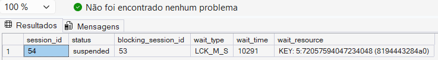
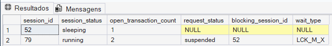

# 03 — Transactions & Blocking

## 🎯 Objetivo

Este módulo simula e investiga um cenário de **blocking** no SQL Server causado por uma transação mantida aberta.

O objetivo é reproduzir o problema, identificar a sessão bloqueada e a sessão bloqueadora e analisar a transação responsável utilizando DMVs e ferramentas de diagnóstico do SQL Server.

---

## 🧪 Cenário

O teste foi realizado utilizando duas sessões diferentes no SQL Server Management Studio (SSMS).

Na primeira sessão, foi iniciada uma transação contendo um `UPDATE`:

```sql
BEGIN TRAN;

UPDATE dbo.Clientes
SET Nome = 'Ana ALTERADA'
WHERE ClienteID = 1;
```

A transação foi mantida aberta propositalmente, sem executar `COMMIT` ou `ROLLBACK`.

Em uma segunda sessão, foi executada uma consulta sobre o mesmo registro:

```sql
SELECT *
FROM dbo.Clientes
WHERE ClienteID = 1;
```

A consulta ficou aguardando a liberação do recurso, caracterizando um cenário de blocking.

---

## 🔎 Diagnóstico

A DMV `sys.dm_exec_requests` foi utilizada para identificar requisições bloqueadas.

Durante o teste, a sessão bloqueada apresentou informações semelhantes a:

| Propriedade | Resultado observado |
|---|---|
| Session ID | 54 |
| Status | suspended |
| Blocking Session | 53 |
| Wait Type | LCK_M_S |

Os IDs das sessões são dinâmicos e podem mudar entre execuções.

### LCK_M_S

O wait type `LCK_M_S` indica que a requisição está aguardando a obtenção de um **Shared Lock (S)**.

No cenário reproduzido, a leitura não conseguiu prosseguir porque outra sessão mantinha uma transação de escrita aberta sobre o recurso necessário.

---

## 📸 Evidência do laboratório

Durante a simulação, o blocking foi identificado através da DMV
`sys.dm_exec_requests`.



No cenário observado, a sessão `54` estava com status `suspended` e
aguardava um Shared Lock (`LCK_M_S`), enquanto a sessão `53` foi
identificada como a sessão bloqueadora.

> Os IDs das sessões são atribuídos dinamicamente pelo SQL Server e podem
> ser diferentes em outras execuções do laboratório.

---

## 💤 Sessão sleeping com transação aberta

Durante a investigação, a sessão bloqueadora apareceu como `sleeping`.

Isso demonstrou um ponto importante:

> Uma sessão `sleeping` não significa necessariamente que ela não esteja mantendo locks.

Uma conexão pode estar sem uma requisição ativa naquele instante e ainda possuir uma transação aberta.

A coluna `open_transaction_count` ajudou a identificar essa situação.

---

## 🕵️ Identificando o comando responsável

Após identificar a sessão bloqueadora, foi utilizado:

```sql
DBCC INPUTBUFFER(<session_id>);
```

O comando permitiu visualizar o último batch enviado pela sessão.

No laboratório, isso ajudou a identificar o `BEGIN TRAN` seguido pelo `UPDATE` que originou o blocking.

---

## 📸 Evidência do laboratório



Durante o teste, a sessão `52` foi identificada com status `sleeping`,
mas ainda possuía uma transação aberta (`open_transaction_count = 1`).

Ao mesmo tempo, outra sessão aguardava a liberação do recurso, demonstrando
que uma sessão sem requisição ativa ainda pode manter locks quando existe
uma transação aberta.

> Os IDs das sessões e os tipos de espera podem variar entre execuções do laboratório.

---

## 🔄 Resolução

Como a alteração foi realizada apenas para simular o problema, a transação foi revertida:

```sql
ROLLBACK;
```

O `ROLLBACK` precisou ser executado na mesma sessão em que o `BEGIN TRAN` havia sido iniciado.

Após a finalização da transação, os locks foram liberados e a sessão bloqueada pôde continuar.

---

## 🧠 Fluxo de investigação

```text
Consulta aguardando
        ↓
sys.dm_exec_requests
        ↓
blocking_session_id
        ↓
Sessão bloqueadora
        ↓
Transação aberta
        ↓
DBCC INPUTBUFFER
        ↓
Comando responsável
        ↓
Análise da causa
        ↓
COMMIT / ROLLBACK quando apropriado
```

> Em um ambiente de produção, uma sessão bloqueadora não deve ser encerrada automaticamente sem investigar a operação, o impacto e o possível rollback.

---

## 🧪 Scripts

- `blocking_simulation.sql` — reproduz o cenário de blocking.
- `blocking_diagnostics.sql` — contém consultas utilizadas para investigação.

---

## 📌 Aprendizados

Neste módulo foram praticados:

- funcionamento básico de transações;
- `BEGIN TRAN`, `COMMIT` e `ROLLBACK`;
- conceito de blocking;
- identificação de sessões bloqueadas e bloqueadoras;
- interpretação do wait type `LCK_M_S`;
- utilização de `sys.dm_exec_requests`;
- utilização de `sys.dm_exec_sessions`;
- análise de transações abertas;
- utilização de `DBCC INPUTBUFFER`;
- relação entre sessões `sleeping`, transações abertas e locks.
