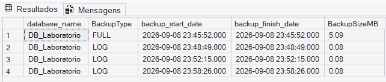
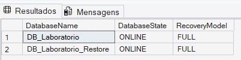

# 04 — Backup & Restore

## 🎯 Objetivo

Este módulo demonstra a criação e restauração de backups no SQL Server, utilizando **FULL Backup** e **Transaction Log Backups**.

O objetivo é construir uma cadeia de backups e utilizá-la para restaurar o banco de dados em uma base separada, preservando o ambiente original.

---

## 💾 Estratégia utilizada

Durante o laboratório foi utilizada a seguinte sequência:

```text
FULL Backup
     ↓
alterações no banco
     ↓
LOG Backup 01
     ↓
novas alterações
     ↓
LOG Backup 02
     ↓
Restore
```

Os backups de Transaction Log permitem preservar a sequência de alterações ocorridas no banco e são fundamentais em estratégias de recuperação mais granulares.

---

## 🔄 Recovery Model

O banco `DB_Laboratorio` utiliza o Recovery Model `FULL`.

É importante diferenciar:

**FULL Recovery Model** — define como o Transaction Log é gerenciado e possibilita estratégias que incluem backups do log.

**FULL Backup** — é um tipo de backup que contém os dados necessários para representar o banco no momento do backup.

Portanto, os dois conceitos possuem finalidades diferentes.

---

## 📦 FULL Backup

O backup completo foi realizado utilizando:

```sql
BACKUP DATABASE DB_Laboratorio
TO DISK = '...DB_Laboratorio_FULL.bak'
WITH
    INIT,
    CHECKSUM,
    STATS = 10;
```

Neste laboratório:

- `INIT` inicializa o arquivo de mídia para o novo backup;
- `CHECKSUM` adiciona verificações de integridade durante o processo;
- `STATS = 10` apresenta informações de progresso da operação.

---

## 🔍 Verificação do backup

Após a criação do FULL Backup, foi utilizado:

```sql
RESTORE VERIFYONLY
FROM DISK = '...DB_Laboratorio_FULL.bak'
WITH CHECKSUM;
```

`RESTORE VERIFYONLY` é útil para verificar se o conjunto de backup pode ser lido e possui a estrutura esperada.

> A verificação não substitui um teste real de restauração. Uma estratégia de backup deve também considerar testes periódicos de restore.

---

## 📝 Transaction Log Backups

Foram criados backups sequenciais do Transaction Log:

```text
DB_Laboratorio_LOG_01.trn
DB_Laboratorio_LOG_02.trn
```

Entre os backups foram realizadas alterações no banco para criar diferentes pontos na cadeia de recuperação.

---

## 📸 Evidência do laboratório

O histórico de backups registrado no banco de sistema `msdb` foi consultado
para validar a sequência de backups realizada durante o laboratório.



O histórico mostra o FULL Backup utilizado como base e os Transaction Log
Backups realizados posteriormente.

A consulta ao `msdb` permite verificar informações como tipo do backup,
horário de início e término e tamanho do arquivo gerado.

---

## ♻️ Restaurando a cadeia

Para testar a recuperação sem sobrescrever o banco original, o backup foi restaurado como:

`DB_Laboratorio_Restore`

A sequência utilizada foi:

```text
FULL
 │
 │ NORECOVERY
 ▼
LOG 01
 │
 │ NORECOVERY
 ▼
LOG 02
 │
 │ RECOVERY
 ▼
ONLINE
```
---

### 📸 Validação do restore

Após a aplicação do FULL Backup e dos Transaction Log Backups, o estado
dos bancos foi consultado através da `sys.databases`.



O banco `DB_Laboratorio_Restore` foi encontrado no estado `ONLINE`,
confirmando que a sequência de restauração foi finalizada com sucesso
utilizando `RECOVERY`.

O banco original permaneceu disponível durante o teste, pois a restauração
foi realizada em um banco separado.

---

## ⏳ NORECOVERY

`NORECOVERY` mantém o banco no estado `RESTORING`.

Isso permite que outros backups sejam aplicados antes que o processo de recuperação seja finalizado.

Exemplo:

```sql
RESTORE LOG DB_Laboratorio_Restore
FROM DISK = '...LOG_01.trn'
WITH NORECOVERY;
```

---

## ✅ RECOVERY

`RECOVERY` finaliza a sequência de restauração e torna o banco novamente acessível.

Por isso, deve ser utilizado quando não há mais backups a serem aplicados naquela sequência de restore.

---

## 🧪 Scripts

- `full_backup.sql` — criação e verificação do FULL Backup.
- `log_backup.sql` — criação de Transaction Log Backups.
- `restore_chain.sql` — restauração do FULL seguida pelos backups de log.

---

## 📌 Aprendizados

Neste módulo foram praticados:

- FULL Backup;
- Transaction Log Backup;
- Recovery Model FULL;
- verificação de backups;
- utilização de `CHECKSUM`;
- histórico de backups no `msdb`;
- restauração para um banco separado;
- utilização de `MOVE`;
- utilização de `NORECOVERY`;
- utilização de `RECOVERY`;
- restauração sequencial de uma cadeia de backups.
