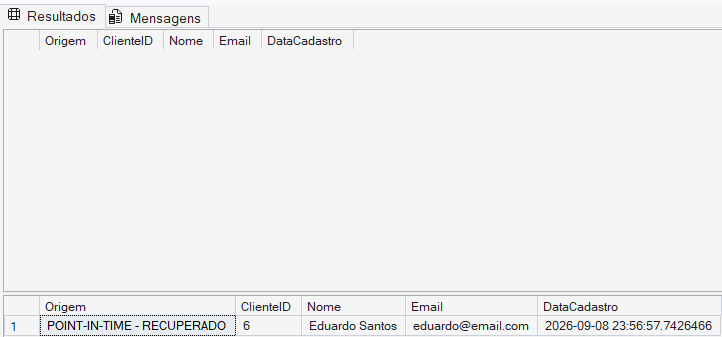

# 05 — Point-in-Time Recovery

## 🎯 Objetivo

Este módulo demonstra a recuperação de um banco de dados SQL Server para um momento específico utilizando **Point-in-Time Recovery (PITR)**.

O cenário simula a exclusão acidental de um registro e utiliza uma cadeia de backups para recuperar o banco até um instante anterior ao incidente.

---

## 🚨 Cenário do incidente

Um registro de teste foi criado na tabela `dbo.Clientes`:

```sql
INSERT INTO dbo.Clientes (Nome, Email)
VALUES ('Eduardo Santos', 'eduardo@email.com');
```

Antes do incidente, foi registrado um ponto seguro utilizando:

```sql
SELECT SYSDATETIME() AS PontoSeguro;
```

No laboratório realizado, o ponto registrado foi:

```text
2026-09-08 23:57:50.2576444
```

Posteriormente, o registro foi excluído:

```sql
DELETE FROM dbo.Clientes
WHERE Email = 'eduardo@email.com';
```

Após a exclusão, foi registrado o horário:

```text
2026-09-08 23:58:07.7826542
```

Isso criou uma janela de tempo conhecida na qual o registro ainda existia.

---

## 🕒 Linha do tempo

```text
23:56:57
Eduardo inserido
      │
      ▼
23:57:50
Ponto seguro
      │
      │ ← momento escolhido para recuperação
      ▼
23:58:07
DELETE executado
      │
      ▼
LOG Backup 03
```

O objetivo foi restaurar o banco para um momento posterior à criação do registro, mas anterior ao `DELETE`.

---

## 💾 Cadeia de recuperação

A recuperação utilizou:

```text
FULL Backup
     │
     │ NORECOVERY
     ▼
LOG 01
     │
     │ NORECOVERY
     ▼
LOG 02
     │
     │ NORECOVERY
     ▼
LOG 03 + STOPAT
     │
     │ RECOVERY
     ▼
DB_Laboratorio_PointInTime
```

O banco foi restaurado com outro nome para preservar o banco original.

---

## ⏱️ STOPAT

A opção `STOPAT` permite determinar até qual momento as transações do Transaction Log devem ser aplicadas durante a restauração.

No laboratório foi utilizado:

```sql
STOPAT = '2026-09-08T23:57:51'
```

Esse horário está dentro da janela anterior ao `DELETE`.

O `STOPAT` não recupera diretamente um único registro. Ele determina o ponto no tempo para o qual o banco inteiro será recuperado.

---

## ⚠️ Problema encontrado

Durante a primeira tentativa foi utilizado:

```sql
STOPAT = '2026-09-08T23:57:50.2576444'
```

A restauração retornou:

```text
Msg 3217
Valor inválido especificado para o parâmetro STOPAT.

Msg 3013
RESTORE LOG está sendo encerrado de forma anormal.
```

Como parte do troubleshooting, o valor utilizado em STOPAT foi revisado antes de uma nova tentativa de restauração.

---

## 🔧 Correção aplicada

Foi utilizado um horário com precisão em segundos, ainda dentro da janela anterior ao incidente:

```sql
STOPAT = '2026-09-08T23:57:51'
```

A restauração foi então executada com sucesso.

Esse horário continuava sendo anterior ao incidente e posterior à criação do registro que deveria ser recuperado.

---

## 🔍 Validação

Após a recuperação, o registro foi consultado no banco restaurado:

```sql
SELECT *
FROM DB_Laboratorio_PointInTime.dbo.Clientes
WHERE Email = 'eduardo@email.com';
```

---

### 📸 Evidência da recuperação



Na primeira consulta, realizada no banco original após o incidente, nenhum
registro foi encontrado.

Na segunda consulta, realizada no banco
`DB_Laboratorio_PointInTime`, o registro de `Eduardo Santos` estava
presente novamente.

Isso demonstra que o banco restaurado representa um estado anterior ao
`DELETE`, enquanto o banco original permanece no estado posterior ao
incidente.

---

O registro de Eduardo estava novamente presente, demonstrando que o banco foi recuperado para um estado anterior à exclusão.

---

## 🧠 Conceito importante

Point-in-Time Recovery depende de uma cadeia de backups válida.

A sequência dos Transaction Log Backups deve ser preservada para que o SQL Server consiga reconstruir as alterações até o ponto desejado.

O processo pode ser resumido como:

```text
Incidente identificado
        ↓
Determinar horário anterior ao incidente
        ↓
Localizar cadeia de backups necessária
        ↓
Restaurar FULL com NORECOVERY
        ↓
Aplicar LOGs em sequência
        ↓
Aplicar último LOG com STOPAT
        ↓
RECOVERY
        ↓
Validar os dados recuperados
```

---

## 🧪 Scripts

- `incident_simulation.sql` — simulação da exclusão acidental.
- `point_in_time_restore.sql` — restauração utilizando `STOPAT`.

---

## 📌 Aprendizados

Neste módulo foram praticados:

- Point-in-Time Recovery;
- utilização de `STOPAT`;
- restauração sequencial de Transaction Log Backups;
- `NORECOVERY` e `RECOVERY`;
- definição de um ponto seguro;
- recuperação após exclusão acidental;
- diagnóstico de erro durante um restore;
- validação dos dados após recuperação.
