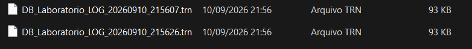
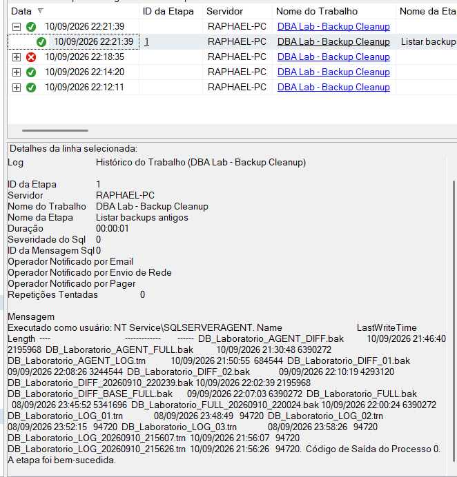
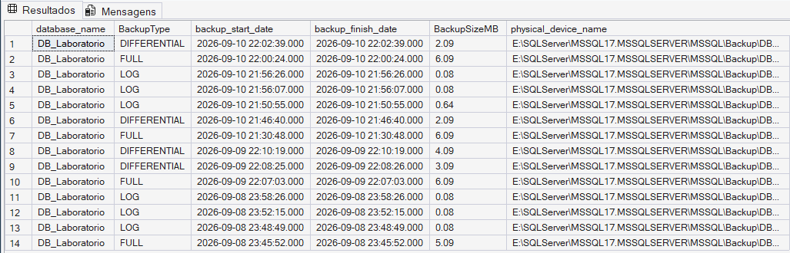

# 07 — SQL Server Agent

## 🎯 Objetivo

Este módulo demonstra a automação de rotinas de backup utilizando o **SQL Server Agent**.

Foram criados Jobs separados para:

- FULL Backup;
- Differential Backup;
- Transaction Log Backup;
- limpeza de backups antigos.

Além da criação dos Jobs, o laboratório incluiu schedules, geração dinâmica de nomes de arquivos, retenção, tratamento de erros e troubleshooting de permissões.

---

## ⚙️ Arquitetura

A estratégia utilizada no laboratório foi:

```text
                    SQL SERVER AGENT
                           │
        ┌──────────────────┼──────────────────┐
        │                  │                  │
       FULL               DIFF               LOG
        │                  │                  │
 Domingo 02:00       Seg–Sáb 02:00      A cada 30 min
        │                  │                  │
        └────────── arquivos com timestamp ───┘
                           │
                           ▼
                    BACKUP CLEANUP
                           │
                    Diário às 04:00
```

---

## 💾 FULL Backup

Foi criado o Job:

```text
DBA Lab - Backup FULL
```

Schedule:

```text
Domingo às 02:00
```

Cada execução gera um arquivo independente utilizando timestamp:

```text
DB_Laboratorio_FULL_YYYYMMDD_HHMMSS.bak
```

Exemplo:

```text
DB_Laboratorio_FULL_20260910_220024.bak
```

Isso evita depender da sobrescrita contínua de um único arquivo de backup.

---

## 🔄 Differential Backup

Foi criado o Job:

```text
DBA Lab - Backup DIFFERENTIAL
```

Schedule:

```text
Segunda a sábado às 02:00
```

Formato do arquivo:

```text
DB_Laboratorio_DIFF_YYYYMMDD_HHMMSS.bak
```

O Differential Backup registra as extensões modificadas desde sua base diferencial.

A estratégia utilizada foi:

```text
Domingo
FULL
 │
 ├── Segunda → DIFF
 ├── Terça   → DIFF
 ├── Quarta  → DIFF
 ├── Quinta  → DIFF
 ├── Sexta   → DIFF
 └── Sábado  → DIFF
```

---

## 🧾 Transaction Log Backup

Foi criado o Job:

```text
DBA Lab - Backup LOG
```

Schedule:

```text
Todos os dias
A cada 30 minutos
```

Cada execução gera um arquivo `.trn` independente:

```text
DB_Laboratorio_LOG_YYYYMMDD_HHMMSS.trn
```

Exemplo:

```text
DB_Laboratorio_LOG_20260910_215607.trn
DB_Laboratorio_LOG_20260910_215626.trn
```

Durante o laboratório, inicialmente foi utilizado um único arquivo:

```text
DB_Laboratorio_AGENT_LOG.trn
```

Esse modelo foi substituído pela geração de arquivos com timestamp para evitar a sobrescrita dos backups anteriores e preservar os arquivos necessários à estratégia de recuperação.

### Evidência

A execução automatizada gerou arquivos de Transaction Log distintos,
utilizando data e hora no nome de cada arquivo.



---

## 🕐 Geração dinâmica de nomes

Os Jobs utilizam a data e hora da execução:

```sql
SET @Timestamp =
    CONVERT(CHAR(8), GETDATE(), 112) + '_' +
    REPLACE(CONVERT(CHAR(8), GETDATE(), 108), ':', '');
```

O formato utilizado é:

```text
YYYYMMDD_HHMMSS
```

Exemplo:

```text
20260910_215530
```

que representa:

```text
10/09/2026 21:55:30
```

Essa nomenclatura também facilita a ordenação cronológica dos arquivos.

---

## 🧹 Backup Cleanup

Foi criado o Job:

```text
DBA Lab - Backup Cleanup
```

Schedule:

```text
Diariamente às 04:00
```

A política de retenção utilizada no laboratório foi:

| Tipo | Retenção |
|---|---:|
| Transaction Log | 7 dias |
| Differential | 14 dias |
| FULL | 28 dias |

O Job trabalha somente com arquivos que seguem os padrões:

```text
DB_Laboratorio_LOG_*.trn
DB_Laboratorio_DIFF_*.bak
DB_Laboratorio_FULL_*.bak
```

Isso reduz o risco de a rotina atingir backups pertencentes a outros bancos existentes na mesma pasta.

---

## 🔍 Estrutura do Cleanup Job

O Job foi dividido em duas etapas:

```text
Step 1
Listar backups antigos
        │
        ▼
Step 2
Excluir backups expirados
```

O fluxo configurado foi:

```text
Step 1
├── Sucesso → próxima etapa
└── Falha   → encerrar Job com falha

Step 2
├── Sucesso → encerrar Job com sucesso
└── Falha   → encerrar Job com falha
```

---

## 🛠️ Troubleshooting — PowerShell e permissões

Durante a criação do Job de Cleanup, o PowerShell encontrou:

```text
Access denied
```

ao tentar acessar a pasta de backups.

O script inicialmente apresentava o erro na mensagem, mas o SQL Server Agent ainda registrava a etapa como bem-sucedida.

Para tornar o erro bloqueante foi utilizado:

```powershell
$ErrorActionPreference = "Stop"
```

Após essa alteração, o Job passou a registrar corretamente a falha.

A execução do PowerShell utilizava a conta:

```text
NT SERVICE\SQLSERVERAGENT
```

Foi então concedida à conta a permissão necessária sobre a pasta de backups.

Após a correção, o Job foi executado com sucesso.

---

## 🔐 Princípio de menor privilégio

Não foi concedido `Full Control` à conta do SQL Server Agent.

Foram utilizadas permissões suficientes para o laboratório, como:

```text
Modify
Read & Execute
List Folder Contents
Read
Write
```

O objetivo foi permitir que o Agent pudesse consultar e remover arquivos da pasta sem conceder permissões desnecessárias.

---

## ✅ Validação da rotina de Cleanup

Após a correção do script e das permissões, o Job executou:

```text
Step 1 — Listar backups antigos      ✅
Step 2 — Excluir backups expirados  ✅
```

Como todos os backups existentes eram recentes, o resultado foi:

```text
Limpeza concluida. Arquivos removidos: 0
```

### Evidência

O histórico do SQL Server Agent foi utilizado para acompanhar as execuções
do Job e validar o comportamento da rotina durante o troubleshooting.



Esse resultado confirmou que a rotina estava funcional sem excluir arquivos válidos.

---

## 📊 Validação pelo msdb

O histórico de backups foi consultado utilizando:

```sql
SELECT
    bs.database_name,
    CASE bs.type
        WHEN 'D' THEN 'FULL'
        WHEN 'I' THEN 'DIFFERENTIAL'
        WHEN 'L' THEN 'LOG'
        ELSE bs.type
    END AS BackupType,
    bs.backup_start_date,
    bs.backup_finish_date,
    CAST(bs.backup_size / 1024.0 / 1024.0 AS DECIMAL(10,2)) AS BackupSizeMB,
    bmf.physical_device_name
FROM msdb.dbo.backupset AS bs
INNER JOIN msdb.dbo.backupmediafamily AS bmf
    ON bs.media_set_id = bmf.media_set_id
WHERE bs.database_name = 'DB_Laboratorio'
ORDER BY bs.backup_finish_date DESC;
```

A consulta confirmou a criação de backups FULL, Differential e Transaction Log pelos Jobs.

### Evidência

O histórico armazenado no `msdb` confirmou as execuções de backups
FULL, Differential e Transaction Log realizadas durante o laboratório.



---

## 📂 Scripts

```text
07-sql-server-agent/
├── full_backup_job.sql
├── differential_backup_job.sql
├── transaction_log_backup_job.sql
├── backup_cleanup.ps1
└── README.md
```

---

## 📌 Aprendizados

Neste módulo foram praticados:

- SQL Server Agent;
- criação de Jobs;
- criação de Steps;
- schedules;
- execução manual de Jobs;
- Job History;
- FULL Backup automatizado;
- Differential Backup automatizado;
- Transaction Log Backup automatizado;
- geração dinâmica de nomes de arquivos;
- PowerShell dentro do SQL Server Agent;
- política de retenção;
- tratamento de erros;
- troubleshooting de permissões;
- conta de serviço `NT SERVICE\SQLSERVERAGENT`;
- validação de backups pelo `msdb`;
- princípio de menor privilégio.

---

## ⚠️ Observação

A política utilizada neste laboratório tem finalidade didática.

Em ambientes de produção, a estratégia de backup e retenção deve considerar fatores como:

- RPO;
- RTO;
- tamanho e taxa de crescimento do banco;
- capacidade de armazenamento;
- requisitos de auditoria;
- duração dos backups;
- testes periódicos de restore;
- armazenamento dos backups fora do servidor de origem.
