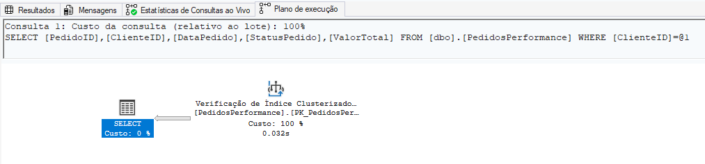
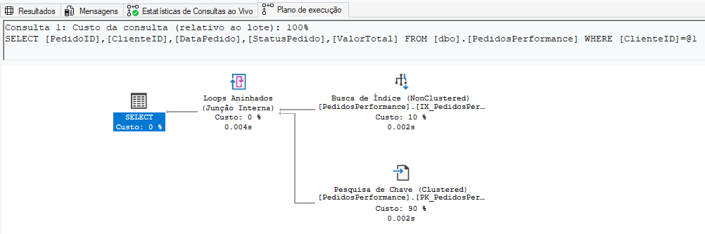
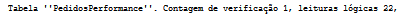
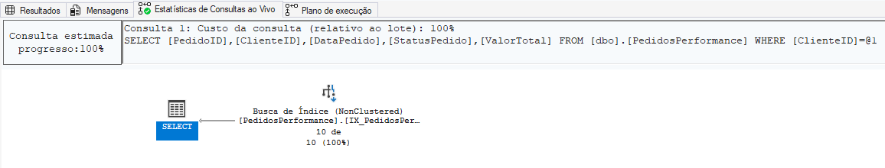
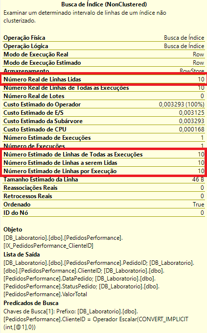
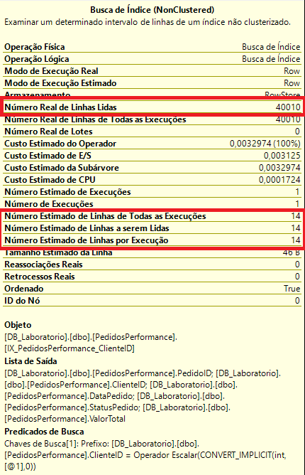
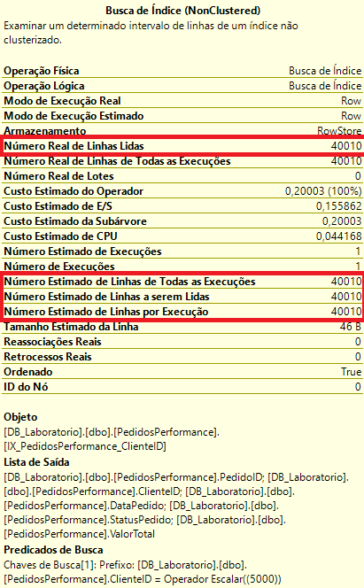
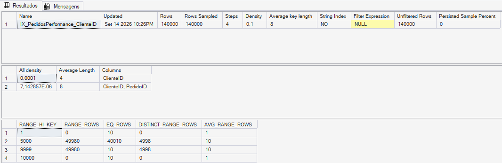
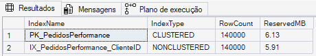
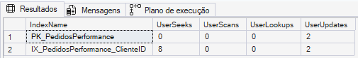

# 09 — Indexes & Statistics

## 🎯 Objetivo

Este módulo demonstra como índices e estatísticas influenciam a performance e os planos de execução no SQL Server.

O laboratório foi construído para analisar, na prática:

- Clustered Index;
- Nonclustered Index;
- Covering Index;
- `INCLUDE`;
- Index Scan e Index Seek;
- Key Lookup;
- Execution Plans;
- `STATISTICS IO`;
- logical reads;
- estatísticas;
- histogramas;
- estimativa de cardinalidade;
- estatísticas desatualizadas;
- espaço e utilização dos índices.

O objetivo não foi apenas criar índices, mas medir seu impacto e entender os custos envolvidos.

---

## 🧪 Ambiente do experimento

Foi criada a tabela:

```sql
dbo.PedidosPerformance
```

com uma Primary Key clustered:

```sql
PRIMARY KEY CLUSTERED (PedidoID)
```

Inicialmente foram inseridos:

```text
100.000 pedidos
10.000 ClienteIDs
≈ 10 pedidos por cliente
```

A consulta utilizada durante a comparação foi:

```sql
SELECT
    PedidoID,
    ClienteID,
    DataPedido,
    StatusPedido,
    ValorTotal
FROM dbo.PedidosPerformance
WHERE ClienteID = 5000;
```

O mesmo `SELECT` foi mantido durante as diferentes etapas para permitir uma comparação consistente.

---

# 🔎 Baseline — sem índice em ClienteID

Inicialmente não existia um índice específico para:

```sql
WHERE ClienteID = 5000
```

O único índice relevante existente era o clustered index da Primary Key em `PedidoID`.

O Execution Plan utilizou:

```text
Clustered Index Scan
```

E o `STATISTICS IO` registrou:

```text
Logical Reads = 561
```

Para retornar aproximadamente 10 registros entre 100.000 linhas, o SQL Server precisou percorrer páginas do clustered index porque não havia uma estrutura adequada para localizar diretamente o `ClienteID`.

### Execution Plan



### Logical Reads


---

# 📈 Nonclustered Index

Foi criado um índice em:

```sql
CREATE NONCLUSTERED INDEX IX_PedidosPerformance_ClienteID
ON dbo.PedidosPerformance (ClienteID);
```

Ao executar exatamente a mesma consulta, o plano mudou para:

```text
Index Seek
    +
Key Lookup
```

E as leituras lógicas caíram de:

```text
561 → 22
```

uma redução aproximada de:

```text
96,1%
```

O `Index Seek` permitiu localizar rapidamente os registros correspondentes ao `ClienteID`.

Entretanto, a consulta também precisava retornar:

```text
DataPedido
StatusPedido
ValorTotal
```

Como essas colunas não estavam disponíveis no índice, o SQL Server realizou um `Key Lookup` no clustered index para recuperar os dados restantes.

### Execution Plan



### Logical Reads



---

# 🚀 Covering Index

O índice foi então recriado utilizando `INCLUDE`:

```sql
CREATE NONCLUSTERED INDEX IX_PedidosPerformance_ClienteID
ON dbo.PedidosPerformance (ClienteID)
INCLUDE
(
    DataPedido,
    StatusPedido,
    ValorTotal
);
```

Com isso, o índice passou a conter as informações necessárias para atender a consulta utilizada no experimento.

O novo plano apresentou apenas:

```text
Index Seek
```

O `Key Lookup` deixou de ser necessário.

As leituras lógicas passaram de:

```text
22 → 3
```

Comparando com o cenário inicial:

```text
561 → 3
```

uma redução aproximada de:

```text
99,5%
```

### Execution Plan



### Logical Reads


---

## 📊 Comparação da otimização

| Cenário | Execution Plan | Logical Reads |
|---|---|---:|
| Sem índice adequado | Clustered Index Scan | 561 |
| Nonclustered simples | Index Seek + Key Lookup | 22 |
| Covering Index | Index Seek | 3 |

Resultado observado:

```text
561
 ↓
22
 ↓
3
```

O experimento demonstrou uma redução de aproximadamente **99,5% nas logical reads** entre o cenário inicial e o covering index.

Isso não significa que todo `Scan` seja ruim ou que todo `Seek` seja bom.

A escolha de um plano depende de fatores como seletividade, distribuição dos dados, volume retornado, estatísticas e custo estimado.

---

# 📊 Statistics

Índices não são a única informação utilizada pelo Query Optimizer.

O SQL Server também mantém **estatísticas sobre a distribuição dos dados**.

Foram consultadas as estatísticas associadas à tabela utilizando:

```sql
sys.stats
```

e:

```sql
DBCC SHOW_STATISTICS
(
    'dbo.PedidosPerformance',
    'IX_PedidosPerformance_ClienteID'
);
```

O comando permite analisar informações como:

```text
STAT_HEADER
DENSITY_VECTOR
HISTOGRAM
```

Essas informações auxiliam o otimizador a estimar quantas linhas uma operação deverá processar.

---

# 🎯 Cardinalidade

No estado inicial, `ClienteID = 5000` possuía 10 registros.

O Actual Execution Plan mostrou:

```text
Estimated Rows = 10
Actual Rows    = 10
```

A estimativa correspondia à cardinalidade real.

### Evidência



---

# ⚠️ Estatística desatualizada

Para demonstrar o impacto de uma mudança significativa na distribuição dos dados, o laboratório desativou temporariamente:

```sql
AUTO_UPDATE_STATISTICS
```

Depois foram inseridos 40.000 novos registros para:

```text
ClienteID = 5000
```

A tabela passou de:

```text
100.000 → 140.000 registros
```

e o `ClienteID = 5000` passou de:

```text
10 → 40.010 registros
```

Como a atualização automática havia sido temporariamente desativada, observamos no plano:

```text
Estimated Rows = 14
Actual Rows    = 40.010
```

A estimativa ficou muito distante da quantidade efetivamente processada.

### Evidência



Esse cenário demonstra por que estatísticas que não representam adequadamente a distribuição atual dos dados podem prejudicar as estimativas utilizadas pelo Query Optimizer.

---

# 🔄 Atualização das estatísticas

A estatística foi atualizada manualmente utilizando:

```sql
UPDATE STATISTICS dbo.PedidosPerformance
    IX_PedidosPerformance_ClienteID
WITH FULLSCAN;
```

`FULLSCAN` foi utilizado para manter o experimento controlado e fazer a estatística considerar todas as linhas.

Isso não significa que `FULLSCAN` deva ser utilizado indiscriminadamente em ambientes de produção.

Após a atualização e nova compilação da consulta:

```text
Estimated Rows = 40.010
Actual Rows    = 40.010
```

### Evidência



---

# 📉 Histograma atualizado

O `DBCC SHOW_STATISTICS` confirmou:

```text
Rows         = 140.000
Rows Sampled = 140.000
```

O histograma passou a representar a concentração existente em `ClienteID = 5000`:

```text
RANGE_HI_KEY = 5000
EQ_ROWS      = 40010
```

### Evidência



Isso permitiu relacionar diretamente:

```text
Distribuição dos dados
        ↓
Statistics
        ↓
Estimativa de cardinalidade
        ↓
Query Optimizer
        ↓
Execution Plan
```

---

# 💾 Custo de armazenamento dos índices

O laboratório também analisou o espaço reservado pelas estruturas.

Resultado observado:

| Índice | Tipo | Linhas | Espaço reservado |
|---|---|---:|---:|
| `PK_PedidosPerformance` | CLUSTERED | 140.000 | 6,13 MB |
| `IX_PedidosPerformance_ClienteID` | NONCLUSTERED | 140.000 | 5,91 MB |

O covering index utilizado para otimizar a consulta passou a ocupar espaço próximo ao próprio clustered index.

### Evidência



Isso demonstra que índices não são gratuitos.

Eles podem melhorar significativamente consultas de leitura, mas também possuem custos relacionados a:

- armazenamento;
- `INSERT`;
- `UPDATE`;
- `DELETE`;
- manutenção.

---

# 🔍 Utilização dos índices

A DMV:

```sql
sys.dm_db_index_usage_stats
```

foi utilizada para consultar métricas como:

```text
user_seeks
user_scans
user_lookups
user_updates
```

Durante o laboratório foi observado:

| Índice | Seeks | Scans | Lookups | Updates |
|---|---:|---:|---:|---:|
| `PK_PedidosPerformance` | 0 | 0 | 0 | 2 |
| `IX_PedidosPerformance_ClienteID` | 8 | 0 | 0 | 2 |

### Evidência



Esses contadores são operacionais e não representam um histórico permanente.

Por isso, um índice não deve ser removido simplesmente porque apresenta pouco uso em uma observação isolada.

---

# ⚖️ Benefício x custo

O principal aprendizado do experimento foi que otimização de índices envolve equilíbrio.

```text
Mais índices
│
├── podem melhorar consultas de leitura
├── ocupam armazenamento
└── aumentam trabalho de manutenção

Menos índices
│
├── reduzem estruturas adicionais
└── podem tornar determinadas consultas mais caras
```

O objetivo não é criar o maior número possível de índices.

O objetivo é criar **os índices adequados ao workload**.

---

# 📂 Scripts

```text
09-indexes-statistics/
├── performance_lab.sql
├── index_optimization.sql
├── statistics_lab.sql
├── index_diagnostics.sql
└── README.md
```

---

# 📌 Aprendizados

Neste módulo foram praticados:

- Clustered Index;
- Nonclustered Index;
- Covering Index;
- included columns;
- Clustered Index Scan;
- Index Seek;
- Key Lookup;
- Actual Execution Plan;
- `STATISTICS IO`;
- logical reads;
- seletividade;
- estatísticas;
- histogramas;
- cardinalidade estimada e real;
- impacto de estatísticas desatualizadas;
- `UPDATE STATISTICS`;
- `FULLSCAN`;
- `OPTION (RECOMPILE)`;
- espaço utilizado por índices;
- `sys.dm_db_index_usage_stats`;
- relação entre performance de leitura e custo de manutenção.

---

## ⚠️ Observação

Os resultados apresentados pertencem a um ambiente controlado de laboratório.

Valores de logical reads, espaço, planos de execução e ganhos de performance dependem do volume, distribuição dos dados, consultas, hardware, configuração da instância e workload.

As técnicas demonstradas devem ser avaliadas de acordo com o cenário real antes de serem aplicadas em produção.
