# Module 10 — Monitoring & Performance

## Objective

Practice SQL Server monitoring and performance diagnostics using Dynamic Management Views (DMVs), wait statistics, execution plans, Query Store and memory counters.

The goal of this module is not only to collect metrics, but to understand how different monitoring tools complement each other during a performance investigation.

---

## Lab Environment

- SQL Server 2025 Developer Edition
- SQL Server Management Studio (SSMS)
- Database: `DB_Laboratorio`
- Recovery Model: `FULL`
- Query Store: `READ_WRITE`
- Query Capture Mode: `AUTO`

---

## 1. Sessions and Active Requests

The first step was monitoring user sessions and currently executing requests.

The following DMVs were used:

- `sys.dm_exec_sessions`
- `sys.dm_exec_requests`
- `sys.dm_exec_sql_text`

An important distinction was observed:

`sys.dm_exec_sessions` contains information about connected sessions and accumulated metrics during their lifetime.

`sys.dm_exec_requests` represents requests that are currently executing.

Therefore, a session with status `sleeping` and accumulated CPU or logical reads is not necessarily consuming those resources at that moment.

---

## 2. Blocking Detection

A controlled blocking scenario was created using two SSMS sessions.

Session 1 started a transaction and updated a row without committing:

```sql
BEGIN TRAN;

UPDATE dbo.Clientes
SET Nome = 'Ana MONITORAMENTO'
WHERE ClienteID = 1;
```

Session 2 attempted to read the same row and became blocked.

The blocking request was detected using `sys.dm_exec_requests`.

The wait type observed was:

```text
LCK_M_S
```

This indicated that the blocked request was waiting to acquire a Shared lock.

### Evidence

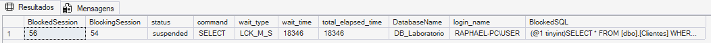

---

## 3. Sleeping Session with an Open Transaction

The blocking session was observed with status:

```text
sleeping
```

However, it still had an open transaction.

Transaction DMVs were used to inspect the session:

- `sys.dm_tran_session_transactions`
- `sys.dm_tran_active_transactions`
- `sys.dm_tran_database_transactions`

This demonstrated an important SQL Server behavior:

> A sleeping session can still hold locks when it has an open transaction.

### Evidence

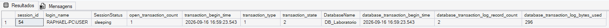

---

## 4. Consolidated Blocking Diagnostics

A diagnostic query was created to correlate:

- blocked session
- blocking session
- blocking session status
- open transaction count
- wait type
- wait duration
- blocked SQL statement
- last command associated with the blocking session

During the experiment, the blocking session was sleeping while the blocked request waited on `LCK_M_S`.

`sys.dm_exec_input_buffer` was also used during the investigation.

It is important to note that the input buffer represents the latest command or batch associated with the session and should not be treated as execution history.

### Evidence

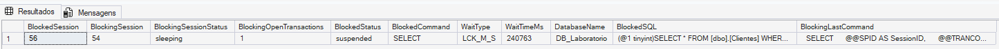

After the experiment, `ROLLBACK` was executed to release the locks and restore the original data.

---

## 5. Wait Statistics

Instance-level waits were analyzed using:

```sql
sys.dm_os_wait_stats
```

The instance start time was also checked because wait statistics are cumulative since the SQL Server instance started or since the statistics were manually cleared.

During the laboratory, `LCK_M_S` accumulated significant wait time, consistent with the controlled blocking scenario created earlier.

Other waits observed were related to internal SQL Server activity.

A high wait value alone was not treated as proof of a performance problem.

Wait statistics should be interpreted together with workload context and other diagnostic information.

### Evidence

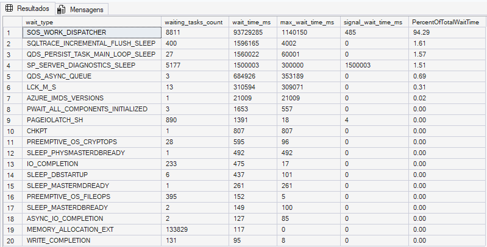

---

## 6. Expensive Queries and Plan Cache

Query performance information was analyzed using:

```sql
sys.dm_exec_query_stats
```

A controlled workload was executed several times against `dbo.PedidosPerformance`.

The query was then identified by accumulated logical reads.

The experiment produced approximately:

```text
Execution Count:       5
Total Logical Reads:   3655
Average Logical Reads: 731
Total CPU:             64.18 ms
Average CPU:           12.84 ms
```

This demonstrated the difference between cumulative metrics and average cost per execution.

`sys.dm_exec_query_stats` should not be considered permanent performance history because its information depends on plans currently available in the plan cache.

### Evidence

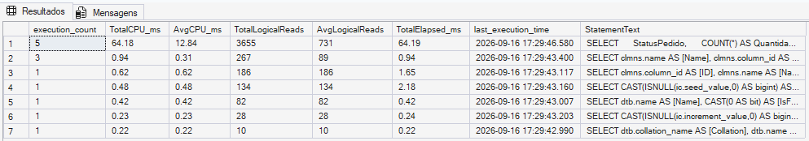

---

## 7. Execution Plan Analysis

The Actual Execution Plan was captured for the monitored query.

The main operator observed was a:

```text
NonClustered Index Scan
```

The existing covering index created in the previous module was based on `ClienteID`, while the monitored query filtered by:

```sql
WHERE StatusPedido = 'Pago'
```

Because `StatusPedido` was not the leading key of the index, SQL Server could not use it as a direct seek predicate for this query.

The execution plan also displayed a missing-index recommendation involving `StatusPedido`.

The recommendation was treated only as a diagnostic clue.

No index was created automatically because missing-index suggestions must be evaluated together with workload characteristics, existing indexes, storage requirements and write overhead.

### Evidence

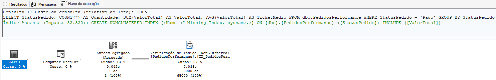

---

## 8. STATISTICS IO and TIME

`SET STATISTICS IO` and `SET STATISTICS TIME` were used to inspect a single execution of the monitored query.

The execution produced:

```text
Logical Reads: 731
Physical Reads: 3
Read-Ahead Reads: 713
```

The 731 logical reads matched the average logical reads previously observed in `sys.dm_exec_query_stats`.

This provided a practical correlation between plan-cache statistics and metrics from an individual execution.

### Evidence

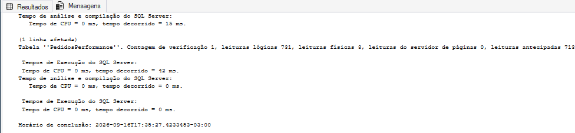

---

## 9. Query Store

Query Store was enabled in the laboratory database with:

```text
State: READ_WRITE
Capture Mode: AUTO
```

The following Query Store objects were explored:

- `sys.query_store_query_text`
- `sys.query_store_query`
- `sys.query_store_plan`
- `sys.query_store_runtime_stats`
- `sys.query_store_runtime_stats_interval`

Unlike the plan-cache-based DMV, Query Store contained historical information from previous laboratory activity.

Historical queries were analyzed using:

- execution count
- average CPU
- average duration
- average logical reads
- last execution time

### Evidence

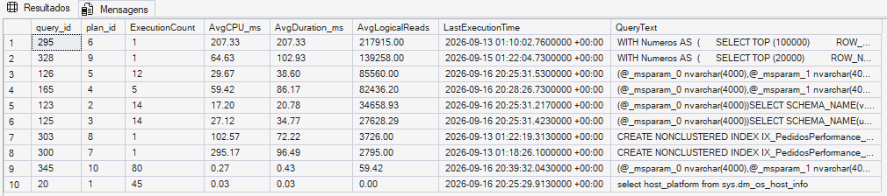

---

## 10. Query Store Runtime Intervals

Query Store runtime statistics were also analyzed by time interval.

This makes it possible to compare how a query behaved during different periods.

However, a difference in duration, CPU or logical reads between intervals does not automatically prove a performance regression.

Other factors such as execution plan, workload, data volume and concurrency must also be considered.

### Evidence

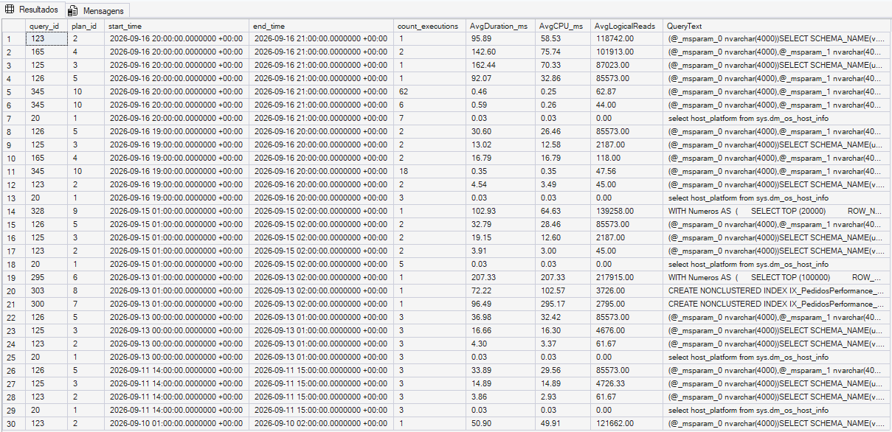

---

## 11. Memory Monitoring

SQL Server memory was analyzed using:

- `sys.dm_os_process_memory`
- `sys.dm_os_performance_counters`
- `sys.dm_os_buffer_descriptors`

`Total Server Memory` and `Target Server Memory` were compared.

During the experiment, the instance showed approximately:

```text
Total Server Memory:  313 MB
Target Server Memory: 6330 MB
```

The difference does not automatically indicate memory pressure.

The laboratory instance had a light workload and SQL Server had no reason to acquire all available target memory.

### Evidence

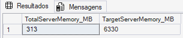

---

## 12. Page Life Expectancy

Page Life Expectancy (PLE) was also inspected.

A low isolated PLE value was not treated as evidence of memory pressure.

PLE should preferably be evaluated using baselines and trends and correlated with other memory indicators.

During the experiment, SQL Server was not signaling physical or virtual memory pressure.

---

## 13. Final Monitoring Snapshot

The module finished with a compact monitoring snapshot containing:

- number of user sessions
- blocked sessions
- sessions with open transactions
- SQL Server process memory
- physical memory pressure indicator
- virtual memory pressure indicator

At the moment of the final snapshot:

```text
User Sessions:              5
Blocked Sessions:           0
Sessions with Open Tran:    0
SQL Process Memory:         175 MB
Physical Memory Low:        0
Virtual Memory Low:         0
```

These values represent only the state of the instance at that specific moment and should not be interpreted as a complete server health assessment.

### Evidence

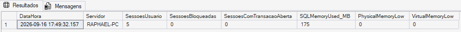

---

## Key Learnings

This module demonstrated that SQL Server performance monitoring requires correlation between multiple sources of information.

The main lessons were:

- `sys.dm_exec_sessions` and `sys.dm_exec_requests` provide different views of activity.
- A sleeping session can still hold locks when a transaction remains open.
- `LCK_M_S` can indicate a request waiting for a Shared lock.
- Wait statistics are cumulative and require context.
- High resource consumption identifies investigation candidates, not automatically bad queries.
- Execution plans help explain why a query consumes resources.
- Missing-index recommendations should be evaluated before implementation.
- `STATISTICS IO` helps measure the amount of work performed by an individual execution.
- `sys.dm_exec_query_stats` depends on the plan cache and is not permanent history.
- Query Store provides historical query, plan and runtime information.
- Memory metrics such as PLE should not be interpreted using isolated thresholds.
- A monitoring snapshot represents a moment in time, not a complete health diagnosis.

---

## Files

```text
10-monitoring-performance/
├── current_activity.sql
├── blocking_monitoring.sql
├── wait_statistics.sql
├── query_performance.sql
├── query_store.sql
├── memory_monitoring.sql
└── README.md
```

---

## Conclusion

The module provided a practical workflow for SQL Server performance investigation:

```text
Observe activity
      ↓
Detect blocking and waits
      ↓
Identify expensive queries
      ↓
Analyze execution plans
      ↓
Measure I/O and CPU
      ↓
Consult historical performance
      ↓
Correlate resource metrics
```

The main takeaway is that no single DMV, counter or execution plan provides a complete diagnosis.

Effective SQL Server monitoring depends on combining evidence and interpreting metrics within the context of the workload.
