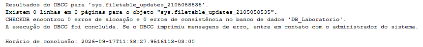
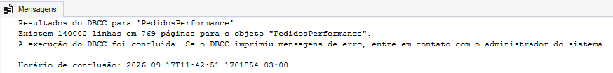
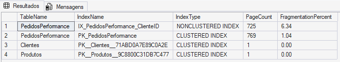
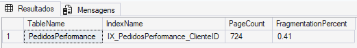
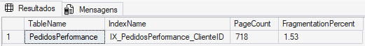
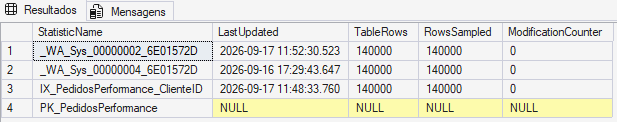
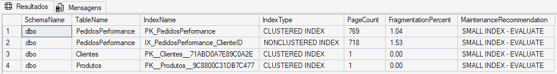
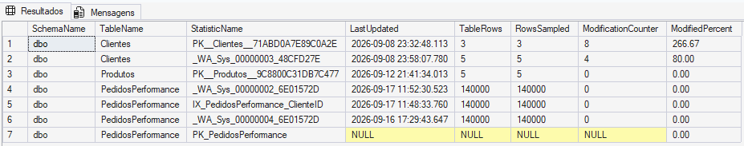

# Module 11 — Integrity & Maintenance

## Objective

Practice SQL Server database integrity validation and maintenance operations using DBCC commands, index fragmentation analysis and statistics maintenance.

The main goal of this module is to understand that maintenance should be based on diagnosis and context rather than automatically executing operations based on isolated thresholds.

---

## Lab Environment

- SQL Server 2025 Developer Edition
- SQL Server Management Studio (SSMS)
- Database: `DB_Laboratorio`
- Recovery Model: `FULL`
- Main test table: `dbo.PedidosPerformance`
- Rows in `PedidosPerformance`: approximately 140,000

---

## 1. Database Integrity Check

Database integrity was validated using:

```sql
DBCC CHECKDB ('DB_Laboratorio');
```

`DBCC CHECKDB` performs consistency checks against the database and its internal structures.

The laboratory database completed the verification with:

```text
0 allocation errors
0 consistency errors
```

This represents the integrity state observed at the moment the command was executed.

### Evidence



---

## 2. DBCC CHECKDB with NO_INFOMSGS

The integrity check was also executed using:

```sql
DBCC CHECKDB ('DB_Laboratorio')
WITH NO_INFOMSGS;
```

`NO_INFOMSGS` suppresses informational messages and keeps the output focused on errors.

When no errors were reported, SSMS displayed only that the command completed successfully.

For documentation purposes, the complete `CHECKDB` output was preferred because it explicitly showed the final integrity summary.

---

## 3. Table-Level Integrity Check

A targeted integrity check was performed against:

```text
dbo.PedidosPerformance
```

using:

```sql
DBCC CHECKTABLE ('dbo.PedidosPerformance');
```

The table contained approximately:

```text
140,000 rows
769 pages
```

No DBCC error messages were reported during the check.

`CHECKTABLE` is useful for targeted validation of a specific object, but it does not replace a complete `CHECKDB` strategy.

### Evidence



---

## 4. Index Fragmentation Analysis

Index fragmentation was analyzed using:

```sql
sys.dm_db_index_physical_stats
```

The initial state of the main indexes was:

```text
IX_PedidosPerformance_ClienteID
Pages:         725
Fragmentation: 6.34%

PK_PedidosPerformance
Pages:         769
Fragmentation: 1.04%
```

The remaining indexes in the laboratory were extremely small.

This demonstrated an important maintenance principle:

> Fragmentation percentage alone should not determine whether an index requires maintenance.

Index size, workload, maintenance cost and expected benefit should also be considered.

### Evidence



---

## 5. Index REORGANIZE

For educational comparison, the following index was reorganized:

```text
IX_PedidosPerformance_ClienteID
```

using:

```sql
ALTER INDEX IX_PedidosPerformance_ClienteID
ON dbo.PedidosPerformance
REORGANIZE;
```

The fragmentation changed from:

```text
Before:
725 pages
6.34%

After REORGANIZE:
724 pages
0.41%
```

`REORGANIZE` incrementally reorganizes the leaf-level pages of the index.

In this laboratory, the operation was executed as an experiment and not because the initial fragmentation represented a proven maintenance requirement.

### Evidence



---

## 6. Index REBUILD

The same index was then rebuilt:

```sql
ALTER INDEX IX_PedidosPerformance_ClienteID
ON dbo.PedidosPerformance
REBUILD;
```

The resulting state was:

```text
718 pages
1.53% fragmentation
```

Interestingly, the measured fragmentation after `REBUILD` was slightly higher than after `REORGANIZE`.

This does not mean that `REBUILD` damaged or worsened the index.

A rebuilt index is not guaranteed to report exactly `0.00%` fragmentation, particularly when working with relatively small indexes.

The experiment also demonstrated that `REBUILD` reconstructs the index structure and updates the statistics associated with that index.

### Evidence



---

## 7. Statistics Analysis

Statistics metadata was inspected using:

- `sys.stats`
- `sys.dm_db_stats_properties`
- `STATS_DATE`

One auto-created statistic on `dbo.PedidosPerformance` showed:

```text
TableRows:            100000
RowsSampled:          100000
ModificationCounter:  40000
```

The table currently contained approximately 140,000 rows.

This provided a useful candidate for a controlled statistics maintenance experiment.

---

## 8. UPDATE STATISTICS with FULLSCAN

The selected statistic was updated using:

```sql
UPDATE STATISTICS dbo.PedidosPerformance
    [_WA_Sys_00000002_6E01572D]
WITH FULLSCAN;
```

After the operation, the statistics properties showed:

```text
TableRows:            140000
RowsSampled:          140000
ModificationCounter:  0
```

`FULLSCAN` caused the statistic to be calculated using all current rows in the table during this experiment.

This operation should not automatically be applied to every statistic in a large production environment because full scans can consume additional I/O, CPU and maintenance time.

### Evidence



---

## 9. Post-Maintenance Integrity Validation

After the index and statistics maintenance experiments, `DBCC CHECKDB` was executed again:

```sql
DBCC CHECKDB ('DB_Laboratorio')
WITH NO_INFOMSGS;
```

The command completed successfully without reporting integrity errors.

The indexes were also inspected again after maintenance.

The main index used during the experiment remained at:

```text
IX_PedidosPerformance_ClienteID
Pages:         718
Fragmentation: 1.53%
```

This completed the maintenance cycle:

```text
Initial validation
        ↓
Maintenance
        ↓
Post-maintenance validation
```

---

## 10. Index Maintenance Diagnostics

A diagnostic query was created to classify indexes according to both fragmentation and size.

The laboratory used the following educational classification:

```text
Less than 1000 pages
    → SMALL INDEX - EVALUATE

1000+ pages and fragmentation < 10%
    → NO ACTION

1000+ pages and fragmentation between 10% and 30%
    → EVALUATE REORGANIZE

1000+ pages and fragmentation >= 30%
    → EVALUATE REBUILD
```

These thresholds are intentionally treated as diagnostic criteria rather than universal production rules.

All indexes in the current laboratory were classified as:

```text
SMALL INDEX - EVALUATE
```

This prevented the maintenance routine from recommending operations solely because a fragmentation percentage existed.

### Evidence



---

## 11. Statistics Maintenance Diagnostics

A second diagnostic query was created to inspect statistics across user tables.

The following information was collected:

- Last update time
- Table rows
- Sampled rows
- Modification counter
- Percentage of modifications

One useful example appeared in the small `Clientes` table.

A statistic showed a modification percentage greater than 200%.

Although this percentage appears high, the underlying table contained very few rows.

This demonstrates why modification percentages should not be interpreted without considering the actual table size and workload.

The `modification_counter` was therefore treated as an investigation indicator rather than an automatic `UPDATE STATISTICS` threshold.

### Evidence



---

## Maintenance Strategy

The laboratory followed a diagnosis-first approach:

```text
Check database integrity
        ↓
Measure index fragmentation
        ↓
Consider index size
        ↓
Identify maintenance candidates
        ↓
Evaluate REORGANIZE or REBUILD
        ↓
Inspect statistics
        ↓
Update statistics when justified
        ↓
Validate integrity again
```

The main principle is:

> Maintenance should respond to evidence rather than execute expensive operations automatically.

---

## Key Learnings

This module demonstrated that:

- `DBCC CHECKDB` validates database consistency and should be part of an integrity-checking strategy.
- `DBCC CHECKTABLE` allows targeted consistency checking of an individual table.
- `NO_INFOMSGS` suppresses informational DBCC output.
- Index fragmentation should not be interpreted without considering index size.
- `REORGANIZE` and `REBUILD` are different maintenance operations.
- `REBUILD` does not guarantee a reported fragmentation value of exactly `0.00%`.
- Rebuilding an index also refreshes its associated index statistics.
- `sys.dm_db_stats_properties` helps identify statistics that deserve investigation.
- `modification_counter` is useful context but should not become an isolated maintenance rule.
- `FULLSCAN` provides complete sampling but can have a higher maintenance cost.
- Post-maintenance validation is an important part of the maintenance workflow.
- Maintenance thresholds should be treated as contextual decision aids rather than universal rules.

---

## Evidence

```text
integrity-checkdb-success.png
integrity-checktable-success.png
maintenance-index-fragmentation-before.png
maintenance-index-fragmentation-after-reorganize.png
maintenance-index-fragmentation-after-rebuild.png
maintenance-statistics-after-update.png
maintenance-index-recommendations.png
maintenance-statistics-monitoring.png
```

---

## Files

```text
11-integrity-maintenance/
├── integrity_checks.sql
├── index_maintenance.sql
├── statistics_maintenance.sql
├── maintenance_diagnostics.sql
└── README.md
```

---

## Conclusion

The module demonstrated that SQL Server maintenance is more than periodically executing `REBUILD`, `UPDATE STATISTICS` or `DBCC CHECKDB`.

A DBA should first understand the current state of the database, collect evidence, evaluate the cost and benefit of an operation and validate the environment after maintenance.

The laboratory therefore followed a simple principle:

```text
Measure → Analyze → Maintain → Validate
```
