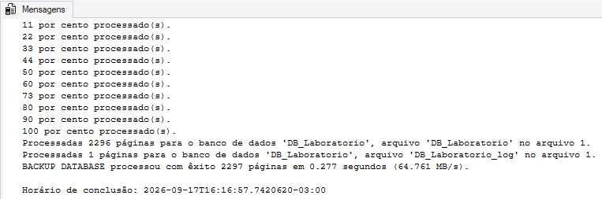
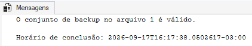
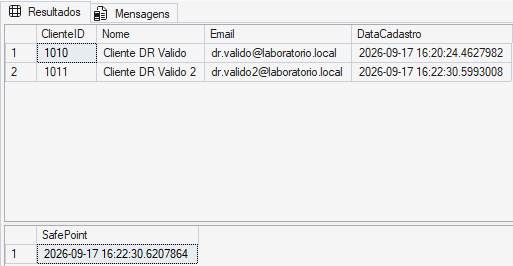
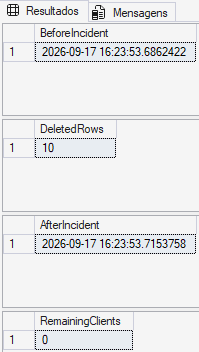
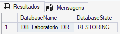
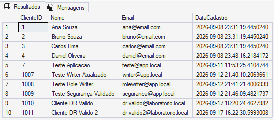
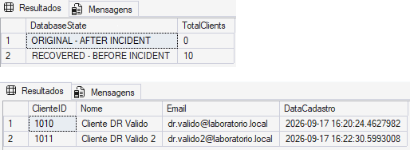
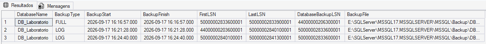
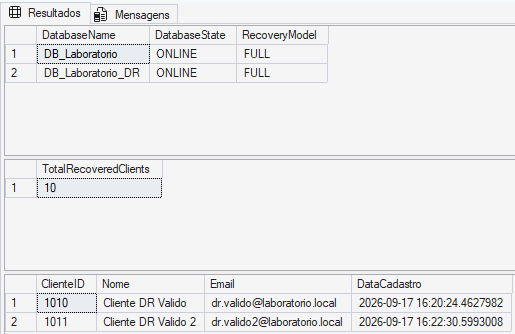
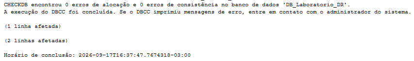

# Module 12 — Disaster Recovery Challenge

## Objective

Simulate a realistic SQL Server data-loss incident and perform a complete Point-in-Time Recovery using a FULL backup and transaction log backups.

Unlike the previous backup and restore modules, this challenge combines multiple recovery concepts into a single incident-response workflow:

- FULL backup
- Transaction log backups
- Backup validation
- Recovery chain
- LSN analysis
- `NORECOVERY`
- Point-in-Time Recovery with `STOPAT`
- `RECOVERY`
- Data validation
- Database integrity validation

The main objective was to recover all legitimate transactions while excluding an accidental destructive operation.

---

## Scenario

`DB_Laboratorio` was operating normally using the `FULL` recovery model.

A new FULL backup was created to establish the beginning of the Disaster Recovery scenario.

After the backup:

1. A valid client was inserted.
2. A transaction log backup was created.
3. A second valid client was inserted.
4. A safe recovery point was recorded.
5. An accidental `DELETE` without a `WHERE` clause removed every row from `dbo.Clientes`.
6. Another transaction log backup captured the activity containing the incident.
7. The database was restored to a separate database using Point-in-Time Recovery.

The objective was:

```text
Preserve valid transactions
        +
Exclude the destructive DELETE
```

---

## Recovery Timeline

The laboratory followed this timeline:

```text
DB_Laboratorio
      │
      ▼
FULL Backup
      │
      ├── Valid transaction #1
      │
      ▼
LOG_01
      │
      ├── Valid transaction #2
      │
      ▼
Safe Point
      │
      ├── Accidental DELETE
      │
      ▼
LOG_02
      │
      ▼
Point-in-Time Recovery
      │
      ▼
DB_Laboratorio_DR
```

---

## 1. Initial Database Validation

Before starting the challenge, the database state was checked.

The environment showed:

```text
DatabaseName:  DB_Laboratorio
RecoveryModel: FULL
DatabaseState: ONLINE
UserAccess:     MULTI_USER
```

The `FULL` recovery model allows transaction log backups to participate in a recovery strategy after the log backup chain has been established.

---

## 2. FULL Backup

A dedicated FULL backup was created for the Disaster Recovery scenario:

```sql
BACKUP DATABASE DB_Laboratorio
TO DISK =
'E:\SQLServer\MSSQL17.MSSQLSERVER\MSSQL\Backup\DB_Laboratorio_DR_FULL.bak'
WITH
    INIT,
    CHECKSUM,
    STATS = 10;
```

This backup became the starting point of the recovery sequence.

### Evidence



---

## 3. Backup Validation

The FULL backup was checked using:

```sql
RESTORE VERIFYONLY
FROM DISK =
'E:\SQLServer\MSSQL17.MSSQLSERVER\MSSQL\Backup\DB_Laboratorio_DR_FULL.bak'
WITH CHECKSUM;
```

SQL Server reported that the backup set was valid.

`RESTORE VERIFYONLY` provides an important validation step, but it does not replace an actual restore test.

### Evidence



---

## 4. First Valid Transaction

After the FULL backup, a new client was inserted:

```text
ClienteID: 1010
Nome: Cliente DR Valido
```

Because this transaction occurred after the FULL backup, recovering it required transaction log backups.

The first log backup was then created:

```text
DB_Laboratorio_DR_LOG_01.trn
```

The recovery timeline became:

```text
FULL
  ↓
Cliente DR Valido
  ↓
LOG_01
```

---

## 5. Second Valid Transaction

A second legitimate client was inserted after `LOG_01`:

```text
ClienteID: 1011
Nome: Cliente DR Valido 2
```

A safe reference point was then recorded:

```text
2026-09-17 16:22:30.6207864
```

At this moment, both new transactions were valid and needed to be preserved.

### Evidence



---

## 6. Simulated Incident

The Disaster Recovery challenge intentionally simulated a destructive user error:

```sql
DELETE FROM dbo.Clientes;
```

No `WHERE` clause was specified.

The incident was recorded as:

```text
BeforeIncident:
2026-09-17 16:23:53.6862422

DeletedRows:
10

AfterIncident:
2026-09-17 16:23:53.7153758

RemainingClients:
0
```

The original database had therefore lost all rows from `dbo.Clientes`.

### Evidence



---

## 7. Capturing the Incident in LOG_02

After the incident, another transaction log backup was created:

```text
DB_Laboratorio_DR_LOG_02.trn
```

This backup contained activity after `LOG_01`, including:

```text
Valid transaction #2
        ↓
Safe Point
        ↓
Destructive DELETE
```

A transaction log backup containing the destructive operation is not automatically useless.

In this scenario, `LOG_02` was necessary because it also contained legitimate activity that occurred before the incident.

Point-in-Time Recovery allowed SQL Server to process this log only up to the desired recovery point.

---

## 8. Restoring the FULL Backup

Instead of overwriting the original database, the recovery was performed into:

```text
DB_Laboratorio_DR
```

The FULL backup was restored using `WITH MOVE` and `NORECOVERY`.

```sql
RESTORE DATABASE DB_Laboratorio_DR
FROM DISK =
'E:\SQLServer\MSSQL17.MSSQLSERVER\MSSQL\Backup\DB_Laboratorio_DR_FULL.bak'
WITH
    MOVE 'DB_Laboratorio'
        TO 'E:\SQLServer\MSSQL17.MSSQLSERVER\MSSQL\DATA\DB_Laboratorio_DR.mdf',

    MOVE 'DB_Laboratorio_log'
        TO 'E:\SQLServer\MSSQL17.MSSQLSERVER\MSSQL\DATA\DB_Laboratorio_DR_log.ldf',

    NORECOVERY,
    CHECKSUM,
    STATS = 10;
```

After the restore:

```text
DB_Laboratorio_DR → RESTORING
```

`NORECOVERY` was essential because additional transaction log backups still needed to be applied.

### Evidence



---

## 9. Restoring LOG_01

The first transaction log backup was applied using:

```sql
RESTORE LOG DB_Laboratorio_DR
FROM DISK =
'E:\SQLServer\MSSQL17.MSSQLSERVER\MSSQL\Backup\DB_Laboratorio_DR_LOG_01.trn'
WITH
    NORECOVERY,
    CHECKSUM,
    STATS = 10;
```

The database remained in:

```text
RESTORING
```

This allowed the recovery sequence to continue with `LOG_02`.

---

## 10. Point-in-Time Recovery

The incident started at:

```text
2026-09-17 16:23:53.6862422
```

For the documented laboratory execution, the selected recovery point was:

```text
2026-09-17T16:23:53
```

This point occurred after the legitimate transactions but before the destructive transaction.

The final log was restored using:

```sql
RESTORE LOG DB_Laboratorio_DR
FROM DISK =
'E:\SQLServer\MSSQL17.MSSQLSERVER\MSSQL\Backup\DB_Laboratorio_DR_LOG_02.trn'
WITH
    STOPAT = '2026-09-17T16:23:53',
    RECOVERY,
    CHECKSUM,
    STATS = 10;
```

`RECOVERY` completed the restore sequence and brought the recovered database online.

> The `STOPAT` value belongs specifically to this laboratory execution. A new execution requires determining a new recovery point from its own incident timeline.

---

## 11. Successful Point-in-Time Recovery

After the final restore:

```text
DB_Laboratorio_DR → ONLINE
```

The recovered `dbo.Clientes` table contained all 10 rows.

Most importantly, the two legitimate transactions created after the FULL backup were present:

```text
1010 | Cliente DR Valido
1011 | Cliente DR Valido 2
```

This demonstrated that the recovery did more than restore the original FULL backup.

The transaction log chain was required to recover those later transactions.

### Evidence



---

## 12. Original vs Recovered Database

The original and recovered databases were compared directly.

The result was:

```text
ORIGINAL - AFTER INCIDENT      | 0
RECOVERED - BEFORE INCIDENT    | 10
```

The original database still represented the state after the destructive `DELETE`, while `DB_Laboratorio_DR` represented the selected point before the incident.

The two post-FULL transactions were also confirmed in the recovered database:

```text
1010 | Cliente DR Valido
1011 | Cliente DR Valido 2
```

### Evidence



---

## 13. Backup Chain and LSN Analysis

The backup history stored in `msdb` was queried using:

```text
dbo.backupset
dbo.backupmediafamily
```

The Disaster Recovery sequence showed:

```text
FULL
  ↓
LOG_01
  ↓
LOG_02
```

The transaction log backups also demonstrated LSN continuity.

In the laboratory:

```text
LOG_01 LastLSN
50000002840100001
        │
        ▼
LOG_02 FirstLSN
50000002840100001
```

LSN stands for **Log Sequence Number**.

LSNs identify positions within the transaction log and are fundamental to SQL Server's ability to maintain and validate a transaction log recovery sequence.

### Evidence



---

## 14. Recovered Data Validation

The recovered database was validated after Point-in-Time Recovery.

The result showed:

```text
DB_Laboratorio_DR → ONLINE
Recovery Model    → FULL
Recovered Clients → 10
```

The two transactions created after the FULL backup were also confirmed:

```text
ClienteID 1010
ClienteID 1011
```

### Evidence



---

## 15. Integrity Validation

The recovered database was checked using:

```sql
DBCC CHECKDB ('DB_Laboratorio_DR');
```

The final result was:

```text
0 allocation errors
0 consistency errors
```

This added an integrity check to the recovery validation process rather than considering the presence of the expected rows alone sufficient evidence.

### Evidence



---

## 16. Restoring the Laboratory Environment

After the Disaster Recovery scenario was successfully completed and validated, the original `DB_Laboratorio` still contained the simulated incident.

At that point:

```text
DB_Laboratorio
→ 0 clients

DB_Laboratorio_DR
→ 10 recovered clients
→ CHECKDB validated
```

For continued use of the laboratory, the validated rows from `DB_Laboratorio_DR` were copied back to `DB_Laboratorio`.

This was performed inside an explicit transaction.

Because `ClienteID` uses `IDENTITY`, `IDENTITY_INSERT` was temporarily enabled so the original identifiers could be preserved.

After validation, the transaction was committed.

`DBCC CHECKIDENT` showed:

```text
Current identity value: 1011
Current column value:   1011
```

No `RESEED` operation was required.

Finally:

```sql
DBCC CHECKDB ('DB_Laboratorio');
```

reported:

```text
0 allocation errors
0 consistency errors
```

This operation was laboratory cleanup and should not be confused with the actual Point-in-Time Recovery, which had already been completed and validated in `DB_Laboratorio_DR`.

---

## Disaster Recovery Strategy

The complete recovery workflow demonstrated in this module was:

```text
Validate recovery model
        ↓
Create FULL backup
        ↓
Validate backup
        ↓
Generate legitimate activity
        ↓
Create LOG backup
        ↓
Generate more legitimate activity
        ↓
Record safe point
        ↓
Simulate destructive incident
        ↓
Capture next LOG backup
        ↓
Restore FULL WITH NORECOVERY
        ↓
Restore LOG_01 WITH NORECOVERY
        ↓
Restore LOG_02 WITH STOPAT
        ↓
RECOVERY
        ↓
Validate recovered data
        ↓
Analyze backup chain / LSNs
        ↓
DBCC CHECKDB
```

---

## Key Learnings

This challenge demonstrated that:

- A Disaster Recovery strategy must be prepared before an incident occurs.
- A FULL backup provides a recovery foundation but may not contain the most recent valid transactions.
- Transaction log backups allow recovery beyond the FULL backup.
- A log backup containing a destructive transaction can still be required for Point-in-Time Recovery.
- `NORECOVERY` keeps the database ready to receive additional backups.
- `STOPAT` allows recovery to stop at a selected point in the transaction log timeline.
- `RECOVERY` completes the restore sequence and makes the database available.
- Restoring into a separate database can preserve the original incident state for investigation and comparison.
- `WITH MOVE` allows restored files to use different physical paths.
- Backup history in `msdb` helps investigate the recovery chain.
- LSNs are fundamental to transaction log sequencing.
- Successful recovery should validate both expected data and database integrity.
- `RESTORE VERIFYONLY` is useful but does not replace an actual restore test.
- Recovery procedures should be tested before they are needed in a real incident.

---

## Evidence

```text
disaster-recovery-full-backup.png
disaster-recovery-full-backup-verify.png
disaster-recovery-safe-point.png
disaster-recovery-incident.png
disaster-recovery-full-restore-norecovery.png
disaster-recovery-point-in-time-success.png
disaster-recovery-original-vs-recovered.png
disaster-recovery-backup-chain.png
disaster-recovery-final-validation-data.png
disaster-recovery-final-validation-checkdb.png
```

---

## Files

```text
12-disaster-recovery-challenge/
├── backup_preparation.sql
├── incident_simulation.sql
├── point_in_time_restore.sql
├── recovery_validation.sql
├── lab_recovery.sql
└── README.md
```

---

## Conclusion

This module transformed the backup and restore concepts studied throughout the SQL Server DBA Lab into a complete Disaster Recovery scenario.

The challenge began with an operational database, introduced legitimate transactions, simulated accidental data loss and recovered the database to the desired point in time using the transaction log chain.

The final result demonstrated a fundamental DBA principle:

```text
A backup is only part of the strategy.

The real objective is successful, validated recovery.
```
